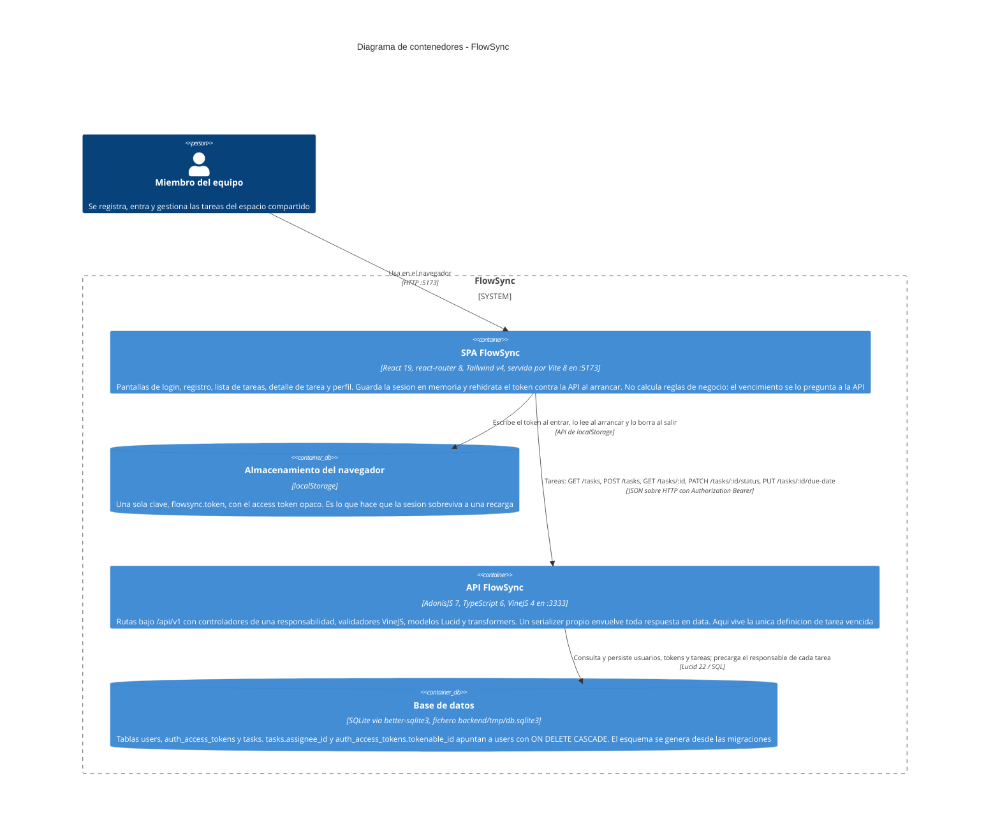

# Arquitectura de FlowSync — diagrama de contenedores

Este diagrama es el nivel 2 del modelo C4 (contenedores): las piezas que se ejecutan por
separado en FlowSync y por dónde se hablan entre ellas. Son cuatro: la **SPA de React**, que
sirve Vite en el puerto 5173 y corre entera en el navegador; el **almacenamiento del
navegador**, donde la SPA guarda el token de sesión bajo la clave `flowsync.token`; la **API
HTTP de AdonisJS**, que escucha en el 3333 y es el único sitio donde vive la lógica de
negocio; y el **fichero SQLite** `backend/tmp/db.sqlite3`, al que la API accede con Lucid.
Las flechas están etiquetadas con los endpoints reales declarados en `backend/start/routes.ts`
y consumidos desde `frontend/src/lib/api.ts` — ni más ni menos. No aparece nada que no se
pueda leer hoy en el repositorio: no hay proxy, ni caché, ni cola, ni servicios externos, y
las dos guardas de auth configuradas se dibujan como una sola porque solo la de tokens
(`api`) se usa en alguna ruta.

## Lo que hay dentro de la API

Detalle verificable de la ruta que sigue una peticion, para que el diagrama no se lea como una caja negra:

| Endpoint | Controlador | Validador | Transformer |
|---|---|---|---|
| `POST /api/v1/auth/signup` | `NewAccountController.store` | `signupValidator` | `UserTransformer` |
| `POST /api/v1/auth/login` | `AccessTokensController.store` | `loginValidator` | `UserTransformer` |
| `GET /api/v1/account/profile` | `ProfileController.show` | — | `UserTransformer` |
| `POST /api/v1/account/logout` | `AccessTokensController.destroy` | — | — |
| `GET /api/v1/tasks` | `TasksController.index` | `listTasksValidator` | `TaskTransformer` + `TaskAssigneeTransformer` |
| `POST /api/v1/tasks` | `TasksController.store` | `createTaskValidator` | `TaskTransformer` |
| `GET /api/v1/tasks/:id` | `TasksController.show` | `taskReferenceDayValidator` | `TaskDetailTransformer` |
| `PATCH /api/v1/tasks/:id/status` | `TaskStatusesController.update` | `updateTaskStatusValidator` | `TaskTransformer` |
| `PUT /api/v1/tasks/:id/due-date` | `TaskDueDatesController.update` | `setTaskDueDateValidator` | `TaskDetailTransformer` |

Los grupos `account` y `tasks` van protegidos con `middleware.auth()`; `auth` es publico.
`silent_auth_middleware` y `force_json_response_middleware` corren sobre todas las peticiones
(`backend/start/kernel.ts`). Los modelos son solo dos, `User` y `Task`, relacionados por
`Task.assignee` (`belongsTo`, clave `assigneeId`).
