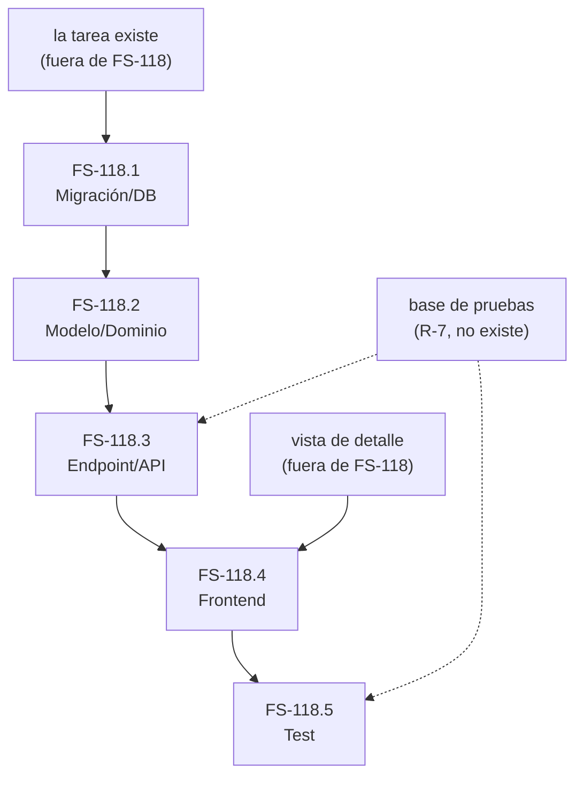

# FS-118 — Fecha de vencimiento y tareas vencidas

**Identificador:** FS-118
**Épica:** E2 · Gestión de tareas
**Traza:** RF-13, RF-14, RF-15 del [PRD](../../prd/flowsync-mvp.md)

## Historia

> Como miembro del equipo, quiero poner o quitar una fecha de vencimiento al abrir una tarea y ver si se ha pasado de plazo, para comprometerme con una fecha solo cuando de verdad existe y no descubrir tarde que se me ha pasado.

> **Nota de estado.** Los criterios marcados **[PROPUESTO]** siguen pendientes de validación: no derivan del PRD, sino que cubren huecos detectados al redactarlos. El resto sale directamente de los requisitos.

---

## Criterios de aceptación

### Camino feliz

**CA-1 — Crear una tarea sin fecha es el camino por defecto**
DADO que voy a crear una tarea nueva
CUANDO escribo el título y la creo
ENTONCES la tarea queda sin fecha de vencimiento
Y en ningún momento del flujo de creación se me ofrece ni se me sugiere ponerle una.

**CA-2 — Poner una fecha al abrir la tarea**
DADO que tengo una tarea sin fecha de vencimiento
CUANDO la abro y le indico una fecha
ENTONCES la tarea queda con esa fecha
Y la veo reflejada al instante, sin recargar ni volver a abrirla.

**CA-3 — Quitar la fecha**
DADO que tengo una tarea con fecha de vencimiento
CUANDO la abro y se la quito
ENTONCES la tarea vuelve a no tener fecha
Y deja de considerarse vencida, si lo estaba.

**CA-4 — Ver que una tarea está vencida** · **[PROPUESTO]**
DADO que existe una tarea con fecha anterior a hoy y que no está hecha
CUANDO la abro
ENTONCES se me indica explícitamente que está vencida, sin que yo tenga que comparar la fecha con el día de hoy.

*Motivo de la propuesta: el requisito de origen pide que sea «evidente sin cálculo mental», y eso no se puede suspender en una prueba. Esta versión exige una señal propia, no solo mostrar la fecha.*

### La regla de vencimiento

**CA-5 — Vencer hoy todavía no es estar vencida**
DADO una tarea cuya fecha de vencimiento es el día de hoy y que no está hecha
CUANDO la abro
ENTONCES no se muestra como vencida, porque la regla exige que la fecha sea **anterior** al día actual.

**CA-6 — Una fecha futura nunca está vencida**
DADO una tarea con fecha posterior a hoy
CUANDO la abro
ENTONCES no se muestra como vencida.

**CA-7 — Sin fecha no se vence nunca**
DADO una tarea sin fecha, creada hace semanas y todavía pendiente
CUANDO la abro
ENTONCES no se muestra como vencida, por muy antigua que sea.

**CA-8 — Darla por hecha la deja de vencer**
DADO una tarea vencida
CUANDO la paso a estado «Hecho»
ENTONCES deja de considerarse vencida
Y conserva su fecha de vencimiento sin ningún cambio.

**CA-9 — Una tarea hecha con la fecha pasada no está vencida**
DADO una tarea en estado «Hecho» cuya fecha ya pasó
CUANDO la abro
ENTONCES no se muestra como vencida.

**CA-10 — Aplazar la fecha resuelve el vencimiento**
DADO una tarea vencida
CUANDO le cambio la fecha a una posterior a hoy
ENTONCES deja de mostrarse como vencida.

### Lo que no debe ocurrir

**CA-11 — La fecha no asoma en la lista**
DADO que hay tareas con fecha, algunas de ellas vencidas
CUANDO miro la lista principal
ENTONCES no veo ninguna fecha ni ninguna marca de vencimiento en ninguna tarea.

**CA-12 — No tener fecha no se penaliza**
DADO una tarea sin fecha
CUANDO la veo en la lista o la abro
ENTONCES no recibo ningún aviso, recordatorio ni señal de que le falte algo.

### Errores y límites

**CA-13 — Poner una fecha que ya pasó está permitido** · **[PROPUESTO]**
DADO que abro una tarea
CUANDO le pongo una fecha anterior a hoy
ENTONCES el sistema la acepta sin impedírmelo
Y la tarea pasa a mostrarse vencida de inmediato.

*Motivo de la propuesta: el PRD no dice si se permite. Se propone permitirlo, porque bloquearlo añadiría una regla de las que este producto rechaza y hay un caso legítimo evidente: anotar algo que ya debería estar hecho.*

**CA-14 — Una fecha imposible no se traga en silencio** · **[PROPUESTO]**
DADO que abro una tarea
CUANDO intento indicar una fecha que no existe o está incompleta
ENTONCES la tarea conserva la fecha que tuviera antes
Y se me explica el problema junto al propio campo, en lenguaje corriente.

**CA-15 — Quitar la fecha no pide confirmación** · **[PROPUESTO]**
DADO una tarea con fecha
CUANDO se la quito
ENTONCES el cambio se aplica directamente, sin diálogo de confirmación.

*Motivo de la propuesta: hace falta fijar la frontera. Borrar una tarea sí confirma porque es irreversible; quitar una fecha se deshace en un gesto, y confirmarlo sería fricción gratuita.*

**CA-16 — El cambio se guarda solo** · **[PROPUESTO]**
DADO que he puesto o quitado la fecha de una tarea
CUANDO cierro la tarea
ENTONCES el cambio ya está guardado, sin ningún paso extra de guardado.

**CA-17 — Cualquiera puede poner o quitar la fecha de cualquier tarea** · **[PROPUESTO]**
DADO una tarea cuyo responsable es otra persona
CUANDO la abro y le cambio la fecha
ENTONCES el cambio se aplica sin advertencia ni permiso especial, igual que el resto de ediciones.

*Motivo de la propuesta: se deduce de los roles planos, pero el PRD nunca lo dice de la fecha en concreto, y es justo el campo donde alguien esperaría una excepción.*

**CA-18 — Reasignar no toca la fecha** · **[PROPUESTO]**
DADO una tarea con fecha de vencimiento
CUANDO cambio su responsable
ENTONCES la fecha se mantiene igual
Y su condición de vencida tampoco varía.

### Paso del tiempo y husos horarios

**CA-19 — Cada persona ve el vencimiento según su propio día**
DADO una tarea cuya fecha ya pasó para quien mira desde un huso, pero es todavía hoy para quien mira desde otro
CUANDO ambas la abren a la vez
ENTONCES la primera la ve vencida y la segunda no
Y las dos lecturas son correctas: el día de referencia es el de quien mira.

**CA-20 — Una tarea vence sola, sin que nadie la toque** · **[PROPUESTO]**
DADO una tarea con fecha de hoy y no hecha
CUANDO pasa la medianoche en el huso de quien mira, y esa persona vuelve a abrirla
ENTONCES aparece como vencida, sin que nadie haya modificado nada.

*Motivo de la propuesta: se deduce de la regla, pero conviene dejarlo escrito porque separa dos comportamientos muy distintos — que el vencimiento se decida en el momento de mirar, o que se congele en el momento de guardar. Solo el primero es compatible con CA-19.*

---

## Criterios que todavía no se pueden escribir

Dependen de decisiones abiertas en el PRD; se dejan anotados para que nadie dé por completa la lista.

- **Volver de «Hecho» a un estado anterior con la fecha pasada.** Por CA-8 la tarea dejó de estar vencida; si se permite el camino de vuelta, debería volver a estarlo. Pendiente de **PA-7**.
- **Dos personas cambiando la fecha de la misma tarea a la vez.** Qué ve quien pierde el cambio está pendiente de **PA-8**.

---

## Tickets

Cada ticket es una unidad de trabajo que una persona termina en una sesión, con media jornada como techo. **Heredan los criterios de arriba**: su Definition of Done es una checklist de *cómo entregamos*, no criterios nuevos. Nombran la capa que tocan; **no diseñan el esquema** (tipo de columna, nulabilidad, índices, rutas y códigos de estado se deciden al implementar).

Las tallas S/M/L miden dentro de ese techo, no en horas. Talla y riesgo van por separado: el ticket más peligroso de esta historia es una M.

### FS-118.1 — Persistir la fecha de vencimiento de una tarea

**Tipo:** Migración/DB · **Talla:** S · **Riesgo:** bajo
**Entrega:** la persistencia pasa a poder representar tanto una tarea con fecha de vencimiento como una sin ella.

- [ ] La migración se ejecuta limpia sobre una base que ya contiene tareas.
- [ ] Su reverso deja el esquema como estaba.
- [ ] Las tareas anteriores a la migración siguen siendo válidas después de aplicarla.
- [ ] El esquema generado se regenera con el comando del proyecto y se commitea; no se edita a mano.
- [ ] Lint, formato y typecheck del backend en verde.

**Depende de:** que la tarea exista (historia de creación, fuera de FS-118).
**Nota de riesgo:** la base de desarrollo y la de pruebas son el mismo fichero; migrar toca también el estado local.

### FS-118.2 — Regla de vencimiento en el dominio

**Tipo:** Modelo/Dominio · **Talla:** M · **Riesgo:** alto
**Entrega:** la lógica que decide si una tarea está vencida (CA-5 a CA-10, CA-19 y CA-20).

- [ ] La regla vive en el dominio y no se reimplementa en ninguna otra capa.
- [ ] Pruebas unitarias de los cuatro bordes: día anterior, mismo día, día posterior y sin fecha.
- [ ] Prueba de que una tarea hecha con la fecha pasada no está vencida, y de que pasar a hecho no altera la fecha.
- [ ] Prueba con dos días de referencia distintos: dos personas obtienen lecturas diferentes y ambas son correctas.
- [ ] Prueba de que una tarea pasa a vencida por el mero avance del día, sin que nadie la modifique.
- [ ] Lint, formato y typecheck del backend en verde.

**Depende de:** FS-118.1.
**Nota de riesgo:** el más peligroso de la historia pese a ser M. CA-5 es la trampa clásica del día de más; CA-19 junto a CA-20 obliga a decidir si el vencimiento se resuelve al mirar o se congela al guardar, y ese fallo no se manifiesta hasta que alguien cruza la medianoche. Es además el nodo con más tickets colgando por detrás.

### FS-118.3 — Fijar y retirar la fecha de una tarea

**Tipo:** Endpoint/API · **Talla:** M · **Riesgo:** medio
**Entrega:** establecer, cambiar y retirar la fecha de una tarea existente, y consultarla junto con su condición de vencimiento.

- [ ] Sigue las convenciones de ruta y de forma de respuesta ya establecidas en el proyecto; nada ad hoc.
- [ ] La respuesta se construye con el transformer correspondiente; no se devuelve el modelo en crudo.
- [ ] La entrada se valida con el mecanismo de validación del proyecto; una fecha no válida se rechaza señalando el campo, con el mismo formato de error que ya usa el resto de la API.
- [ ] Una fecha ya pasada se acepta sin bloquearla.
- [ ] Retirar la fecha es una operación admitida, no un caso de error.
- [ ] Exige sesión iniciada, igual que el resto del espacio, y no comprueba propiedad de la tarea.
- [ ] Pruebas de integración de: fijar, cambiar, retirar y entrada no válida.
- [ ] Los tipos generados para el cliente se regeneran y se commitean si cambian.
- [ ] Lint, formato y typecheck del backend en verde.

**Depende de:** FS-118.2.
**Nota de riesgo:** primeras pruebas que escriben en la base, compartida con el servidor de desarrollo: sin aislar el estado, los fallos van y vienen.

### FS-118.4 — Editar la fecha y señalar el vencimiento, en el detalle de la tarea

**Tipo:** Frontend · **Talla:** M · **Riesgo:** medio
**Entrega:** la interacción de CA-2, CA-3, CA-14, CA-15 y CA-16, más la señal de CA-4 y la ausencia deliberada de CA-11 y CA-12.

- [ ] La llamada a la API se añade al único punto de contacto del proyecto, nunca dentro del componente.
- [ ] El cambio se ve reflejado al instante, sin recargar ni reabrir la tarea, y queda guardado sin ningún paso adicional.
- [ ] Quitar la fecha no abre ningún diálogo de confirmación.
- [ ] Una fecha no válida deja intacta la que hubiera y muestra el mensaje junto al campo, en castellano, reutilizando el mecanismo de errores por campo ya existente.
- [ ] Al abrir una tarea vencida, su condición se comunica con una señal propia: quien mira no tiene que comparar la fecha con hoy.
- [ ] La lista principal no muestra fechas ni marca de vencimiento alguna, y una tarea sin fecha no recibe aviso ni indicación de que le falte algo.
- [ ] La señal no depende solo del color: cumple el contraste y la accesibilidad exigidos al resto de la interfaz, y la interacción es operable con teclado.
- [ ] Se reutilizan los componentes de interfaz del proyecto; los generados no se tocan a mano.
- [ ] Lint, formato y typecheck del frontend en verde.

**Depende de:** FS-118.3 y la vista de detalle de la tarea (fuera de FS-118, ver PA-6 del PRD).
**Nota de riesgo:** no hay ningún componente de fecha en el proyecto; decidir si se trae uno o se resuelve con un campo simple debe hacerse **antes** de empezar. CA-16 y CA-14 rozan entre sí: guardar sin botón y a la vez conservar el valor anterior ante una fecha inválida. Y CA-4 sigue marcado como propuesto: construirlo antes de validarlo puede obligar a rehacerlo.

### FS-118.5 — Cobertura de la historia y sus regresiones

**Tipo:** Test · **Talla:** L (condicional) · **Riesgo:** alto
**Entrega:** los criterios que ningún ticket anterior deja cubiertos, sobre todo los negativos.

- [ ] Cubre CA-1: el flujo de creación no ofrece ni sugiere la fecha.
- [ ] Cubre CA-11 y CA-12 desde fuera: la lista sigue sin mostrar fechas ni marcas, y una tarea sin fecha no genera avisos.
- [ ] Cubre CA-18: reasignar el responsable no altera la fecha ni la condición de vencida.
- [ ] Cubre CA-8 recorriendo el camino real del usuario, no solo la regla de dominio.
- [ ] Cada prueba puede fallar por el motivo que dice cubrir; ninguna pasa por accidente.
- [ ] Las pruebas aíslan su propio estado, no dependen del orden de ejecución y no dejan residuo entre pasadas.
- [ ] Cada prueba nombra en su título el criterio que verifica.

**Depende de:** FS-118.4.
**Nota de riesgo:** es L **solo si carga con el montaje de la base de pruebas**, que hoy no existe (R-7 del PRD); si otra historia ya lo pagó, baja a M. Es el último de la cadena y el portador de los criterios negativos, que son la identidad del producto: por eso es el primero que se sacrifica si la historia se alarga, y por eso conviene no dejarlo para el final.

### Grafo de dependencias

La línea discontinua no bloquea el trabajo: bloquea poder **cerrarlo**, porque el Definition of Done de esos tickets pide pruebas.

### Orden de implementación

| Paso | Ticket | Por qué va aquí |
|---|---|---|
| 1 | FS-118.1 | Nada puede guardarse hasta que exista dónde |
| 2 | FS-118.2 | La regla, antes que cualquier capa que la exponga |
| 3 | FS-118.3 | Cierra el backend completo |
| 4 | FS-118.4 | La interfaz, una vez hay API que consumir |
| 5 | FS-118.5 | Solo tiene sentido con el camino de usuario construido |

**Es una cadena, no un abanico:** los cinco tickets van en serie. Una segunda persona no acelera esta historia; acelera empezando otra.
